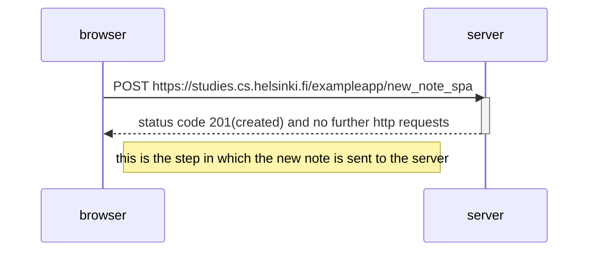

Next, the JS code fetched from the server is run. It will create a new note, add it to the list of notes, rerender the note list on the page, and send the
new note to the server. No reload will be necessary
